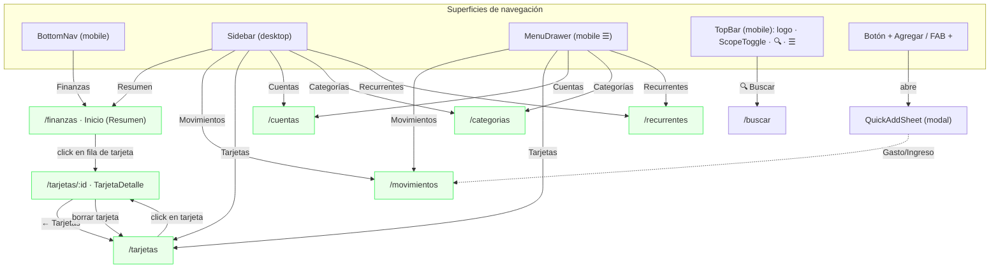
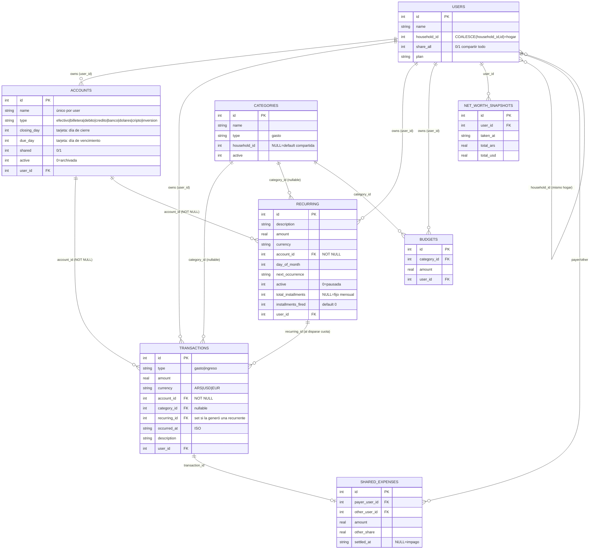
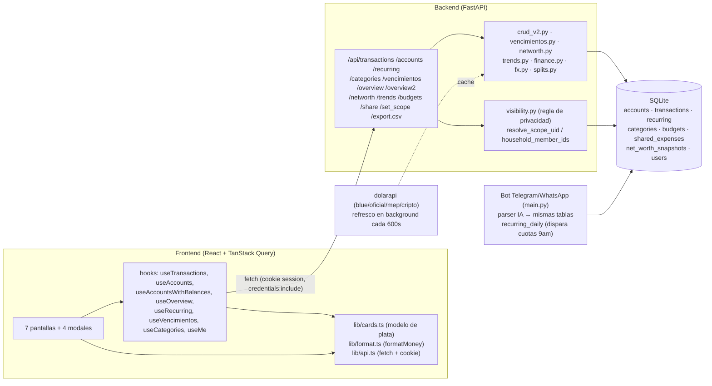

# Módulo de Finanzas (Yumi) — Documentación completa

> Documento generado por análisis exhaustivo del código real (frontend `web-react/` + backend `vps_current/`).
> Todos los textos de interfaz están transcritos **verbatim** del código.
> Objetivo: que cualquier dev / diseñador / PM entienda el módulo completo **sin leer el código**.

## Índice

1. **Este archivo** — vista general, sitemap, mapa de navegación, ERD, mapa conceptual.
2. [`pantallas.md`](./pantallas.md) — ficha exhaustiva de cada pantalla y modal (objetivo, navegación, datos, acciones, botones, campos, validaciones, textos exactos).
3. [`flujos-y-estados.md`](./flujos-y-estados.md) — casos de uso (sequence/activity) y diagramas de estado.
4. [`reglas-de-negocio.md`](./reglas-de-negocio.md) — cálculos (saldos, deuda, cuotas, ciclo/vencimiento, patrimonio), scope/visibilidad, validaciones.
5. [`analisis-critico.md`](./analisis-critico.md) — bugs, inconsistencias, UX, duplicación, nomenclatura, simplificaciones y features faltantes.

---

## 1. Vista general

El módulo de Finanzas es la "cuña" del asistente: registra **plata** (gastos, ingresos, cuentas, tarjetas, cuotas, recurrentes) y la muestra en un dashboard. Es **multi-inquilino por hogar** (cada usuario ve lo suyo + lo compartido de su hogar) y **multi-moneda** (ARS / USD / EUR), valuando a ARS con el dólar **blue** cuando hace falta.

**Pilar técnico clave:** **no hay saldos guardados**. Todo balance se calcula al vuelo desde `transactions` con `SUM(CASE WHEN type='ingreso' THEN amount ELSE -amount END)` por cuenta y moneda. Borrar o editar una transacción cambia los saldos al instante.

**Las 7 pantallas (rutas bajo `AppLayout`):**

| Ruta | Componente | Nombre visible | Rol |
|------|-----------|----------------|-----|
| `/finanzas` | `Inicio` | "Finanzas" (bottom nav) / "Resumen" (sidebar) | Dashboard del mes |
| `/movimientos` | `Movimientos` | "Movimientos" | Lista de transacciones + filtros + bulk |
| `/tarjetas` | `Tarjetas` | "Tarjetas" | Lista de tarjetas de crédito |
| `/tarjetas/:id` | `TarjetaDetalle` | (sin entrada de menú) | Detalle de tarjeta + cuotas |
| `/cuentas` | `Cuentas` | "Cuentas" | Cuentas + saldos + compartir |
| `/categorias` | `Categorias` | "Categorías" | ABM de categorías |
| `/recurrentes` | `Recurrentes` | "Recurrentes" | Recurrentes y cuotas |

**4 modales/forms compartidos:** `QuickAddSheet` (alta rápida "+"), `EditTxModal` (editar movimiento), `AccountForm` (alta/edición de cuenta o tarjeta), `AdjustBalanceModal` (ajustar saldo).

**El modelo de plata, en una frase (de `cards.ts`, textual en la UI):**
> *"A pagar este mes = compras del ciclo + una cuota de cada plan. Deuda total = todo lo que queda por pagar."*

---

## 2. Sitemap + Mapa de navegación

Qué superficie de navegación lleva a cada ruta. Ojo: `/finanzas` se llama **"Finanzas"** en el bottom nav (mobile) y **"Resumen"** en el sidebar (desktop); y `/tarjetas/:id` **no tiene entrada de menú** (se llega tocando una tarjeta).

**Detalle de menús (labels exactos):**

- **BottomNav** (mobile): `Hoy` · `Finanzas` · **[ + ]** (aria `Agregar`) · `Agenda` · `Tareas`. *(Única entrada de finanzas en mobile bottom: `Finanzas`.)*
- **Sidebar** (desktop), grupo **`Finanzas`**: `Resumen` · `Movimientos` · `Tarjetas` · `Cuentas` · `Categorías` · `Recurrentes`. Arriba botón `+ Agregar`.
- **MenuDrawer** (mobile ☰), sección **`Finanzas`**: `Movimientos` · `Tarjetas` · `Cuentas` · `Categorías` · `Recurrentes`. *(No incluye "Resumen"/`/finanzas`.)* Al fondo: `Dashboard viejo →` (`/legacy/`).
- **TopBar**: marca `Yumi` + `ScopeToggle` + `🔍` (aria `Buscar` → `/buscar`) + `☰` (aria `Menú`).

**ScopeToggle** (selector "Ver datos de", presente en TopBar): opciones `Mío` (`mine`) · *nombre de cada conviviente* (`scope_value`) · `Ambos` (`both`). Cambia el cookie `scope` vía `POST /api/set_scope` e **invalida TODAS las queries** (refetch global). Define de quién se ven los datos en todo el módulo.

---

## 3. ERD — Entidades del módulo

Modelo inferido de los `CREATE TABLE`/`ALTER` del backend. **No existe columna `balance`**: el saldo es derivado.

**Relaciones / responsabilidades clave:**
- `TRANSACTIONS` es el libro mayor: de ahí salen TODOS los saldos, KPIs y ciclos. Toda transacción tiene `account_id` obligatorio.
- `RECURRING` modela tanto **fijos mensuales** (`total_installments = NULL`) como **planes de cuotas** (`total_installments` seteado). Al "dispararse" crea una `TRANSACTIONS` con `recurring_id`.
- `CATEGORIES` con `household_id = NULL` son **defaults compartidas** (visibles para todos, no editables salvo admin).
- La dimensión **hogar** (`users.household_id`) + **compartir** (`accounts.shared`, `users.share_all`) gobierna quién ve qué (ver [`reglas-de-negocio.md`](./reglas-de-negocio.md)).

---

## 4. Mapa conceptual / arquitectura funcional

Cómo fluye la información front ↔ back.

**Responsabilidades:**
- **`cards.ts`** = única fuente de verdad de la matemática de tarjetas en el front (consumos, deuda, cuota actual, "a pagar"). El backend **no** envía deuda total ni "a pagar este mes" calculados: el front los compone de `/api/overview` (saldos) + `/api/vencimientos` (ciclos) + `/api/recurring` (cuotas).
- **`/api/overview`** = saldos por cuenta. **`/api/overview2`** = KPIs del dashboard (patrimonio, cashflow, por categoría). Son endpoints distintos y la pantalla Inicio usa **ambos**.
- **`vencimientos.py`** = toda la matemática de ciclo cerrado/abierto y fecha de vencimiento de tarjetas.
- **`visibility.py`** = primitiva central de privacidad (ver lo tuyo + lo compartido del hogar).
- El **bot** comparte la misma DB: los gastos/cuotas también entran por chat.

---

Seguí en [`pantallas.md`](./pantallas.md) para el detalle pantalla por pantalla.
