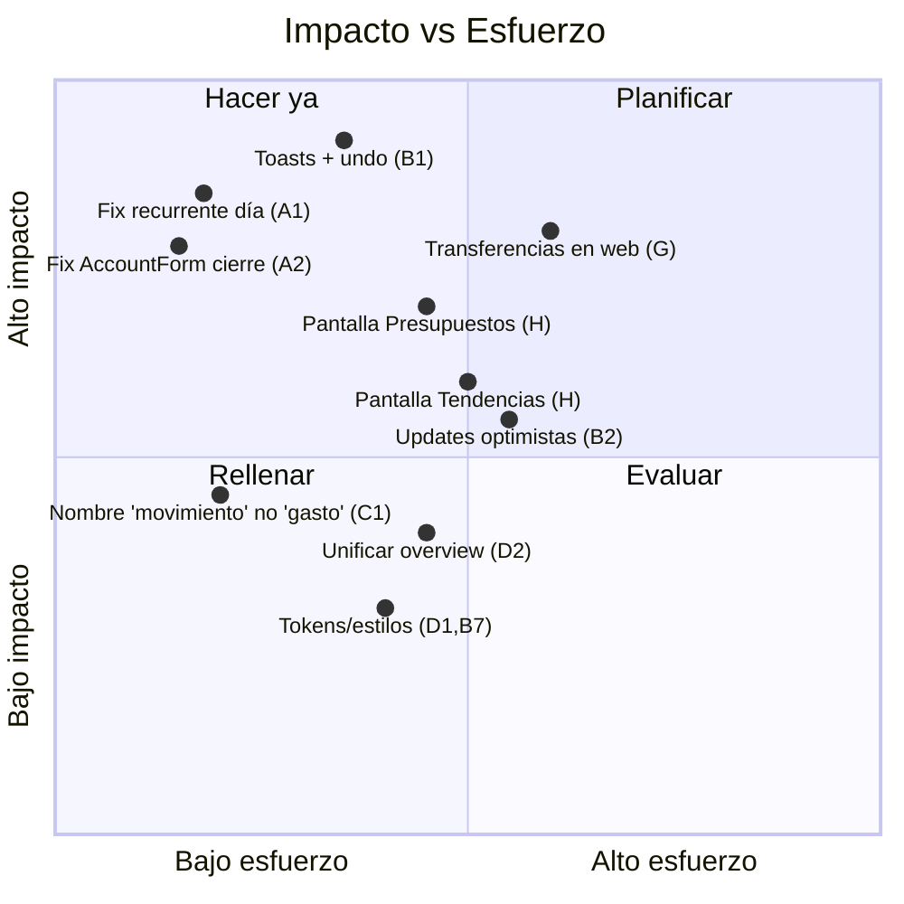

# Finanzas — Análisis crítico

Hallazgos del análisis del código (no solo descripción). Severidad: 🔴 alta · 🟠 media · 🟡 baja.

## A. Bugs

| # | Sev | Bug | Evidencia | Fix sugerido |
|---|-----|-----|-----------|--------------|
| A1 | 🔴 | **Editar un recurrente pisa el `día del mes` con `1`.** El modal de edición hardcodea `type:'gasto'` y `day_of_month:1` en el prefill, y `handleEdit` **sí** envía `day_of_month` → al guardar cualquier edición, el día real se sobrescribe con 1. | `Recurrentes.tsx` (RecurrenteModal `initial`) | Prefill con los valores reales (`r.day_of_month`, tipo real) o no enviar `day_of_month` si no cambió. |
| A2 | 🔴 | **`AccountForm` cierra aunque la mutación falle.** Llama `onClose()` inmediato e incondicional (no en `onSuccess`) → si el POST/PATCH falla (ej. "Ya tenés una cuenta con ese nombre"), el modal se cierra y el usuario cree que guardó. | `AccountForm.tsx` `submit()` | Cerrar en `onSuccess`; mostrar el error en `onError`. |
| A3 | 🟠 | **`AdjustBalanceModal` falla en silencio con entrada inválida.** Si `newBalance` no es número → `return` sin mensaje; el usuario no sabe por qué no pasó nada. | `AdjustBalanceModal.tsx` `handleSave()` | Validar y mostrar error. |
| A4 | 🟠 | **Cuenta solo-USD tratada como ARS.** `arsBalance` cae al primer balance si no hay ARS → `consumos`/`deudaTotal` usan un monto USD como si fuera ARS. | `cards.ts: arsBalance` | Manejar explícitamente cuentas sin ARS (valuar o mostrar en su moneda). |
| A5 | 🟡 | **Decimal con coma vs punto.** El input de monto es texto `inputMode="decimal"` y zod hace `z.coerce.number()`. En es-AR el separador decimal es `,`; `"1,50"` coerce a `NaN`/`1`. | `EditTxModal.tsx`, `QuickAddSheet.tsx` | Normalizar `,`→`.` antes de coerce. |
| A6 | 🟡 | **Inconsistencia de clamp de `day_of_month`.** Creación vía crud_v2 clampa a ≤28; el job de disparo clampa a fin de mes real → un recurrente "día 31" se comporta distinto según el path. | `crud_v2._next_occurrence` vs `recurrence.next_occurrence` | Unificar la regla de día. |

## B. Inconsistencias de UI/UX

| # | Sev | Inconsistencia | Detalle |
|---|-----|----------------|---------|
| B1 | 🔴 | **Cero feedback de éxito/error.** No hay toasts en ningún flujo; los errores se lanzan como `ApiError` (con el body del server) pero **no se muestran**. El usuario no recibe confirmación al crear/editar/borrar, ni ve por qué algo falló (salvo 401 global). | Falta capa de notificaciones. |
| B2 | 🟠 | **Sin updates optimistas.** Toda acción espera el refetch → la UI "tarda" en reflejar cambios. Combinado con B1, se siente lenta/sin respuesta. | TanStack Query sin `onMutate`. |
| B3 | 🟠 | **`/finanzas` tiene dos nombres** según viewport: "Finanzas" (bottom nav) vs "Resumen" (sidebar). Confunde al hablar del producto. | `navItems.ts`. |
| B4 | 🟠 | **"Resumen" (`/finanzas`) no está en el MenuDrawer.** En mobile, desde el menú ☰ no se puede llegar al dashboard de finanzas (sí desde el bottom nav, pero es la única vía). | `MenuDrawer.tsx`. |
| B5 | 🟡 | **`Categorías` no tiene skeleton de carga** (las demás sí) → parpadeo/empty momentáneo. | `Categorias.tsx`. |
| B6 | 🟡 | **Validaciones que existen pero no se muestran:** `closing_day`/`due_day` (AccountForm) y `name` (CategoryFormModal) tienen reglas pero ningún `<small>` de error. | — |
| B7 | 🟡 | **Color de error inconsistente** entre modales: `#a32d2d` (Edit/QuickAdd) vs `#c0392b` (AccountForm). | Tokens de diseño. |

## C. Nomenclatura

| # | Sev | Problema |
|---|-----|----------|
| C1 | 🟠 | **"gasto" como sinónimo de "transacción".** Los confirms dicen `"¿Borrar este gasto?"` / `"¿Borrar N gasto(s)?"` aun cuando la transacción es un **ingreso**. Debería ser "movimiento". |
| C2 | 🟡 | **"Transferencia" es un string mágico.** Categoría literal usada para excluir de totales/trends. Frágil ante renombres/typos/traducción. Debería ser un flag/tipo, no un nombre. |
| C3 | 🟡 | Mezcla "Recurrentes y cuotas" / "Cuotas y tarjetas" / "Recurrentes" como títulos de conceptos solapados. |

## D. Duplicación / lógica repetida

- **D1 🟠 — Estilos inline repetidos** (`fieldStyle`, `inputStyle`, `ctaStyle`, `errStyle`) copiados en cada modal de finanzas. Extraer a componentes/tokens (`Field`, `TextInput`, `PrimaryButton`).
- **D2 🟠 — Dos endpoints de overview** (`/api/overview` para saldos + `/api/overview2` para KPIs) alimentan la **misma** pantalla Inicio → dos round-trips. Consolidar o que `overview2` incluya saldos.
- **D3 🟡 — `fmtDay`/`fmtDate`/`fmtNext`** (formateo `dd/mm`) redefinidos localmente en Tarjetas, TarjetaDetalle y Recurrentes. Mover a `lib/format.ts`.
- **D4 🟡 — Lógica de cuota** (`fired`, `total`, `actual`, `restante`) repetida en TarjetaDetalle y Recurrentes; ya hay `cuotaActual` en `cards.ts` → reusar para todo.

## E. Performance

- **E1 🟠 — `toggleShared` y `set_scope` invalidan TODAS las queries** (`qc.invalidateQueries()` sin key) → refetch global por togglear una cuenta o cambiar de scope. Acotar a las keys afectadas (excepto `set_scope`, donde el refetch global es esperable).
- **E2 🟡 — Sin paginación visible** en Movimientos (limit 200 server-side). Para usuarios con muchos movimientos, agregar scroll infinito/paginado.

## F. Oportunidades de simplificación

- **F1** — Unificar overview (D2) y mover formateadores a `lib/format` (D3).
- **F2** — Reemplazar el string `"Transferencia"` por un `type='transferencia'` o flag `is_transfer` (C2) → más robusto en cálculos.
- **F3** — Un solo componente de modal-form con campos declarativos eliminaría D1 y B6/B7 de raíz.
- **F4** — `cuotaActual`/`enCuotas` como única fuente para todas las vistas de cuotas (D4).

## G. Funcionalidades faltantes (vs. fintech moderna)

| Falta | Estado | Nota |
|---|---|---|
| **Feedback (toasts) + undo** | ❌ | Lo más impactante para la percepción de calidad. "Deshacer" tras borrar. |
| **Transferencias en la web** | ❌ (solo bot) | El usuario no puede mover plata entre cuentas desde la UI; debería ser un tipo de alta de primera clase. |
| **Presupuestos (budgets)** | ⚠️ backend listo, **sin pantalla** | `GET/POST/DELETE /api/budgets` + `budget_status` existen; falta UI. Quick win. |
| **Reportes / tendencias** | ⚠️ backend listo, **sin pantalla** | `GET /api/trends` (por mes/categoría) existe; falta vista de gráficos. |
| **Metas de ahorro** | ⚠️ tabla `savings_goals` | Sin UI. |
| **Split de gastos compartidos** | ⚠️ `splits.py` + `shared_expenses` | Lógica completa (quién debe a quién); sin UI web. |
| **Exportar desde la web** | ⚠️ `/api/export.csv` existe | Sin botón en las pantallas React. |
| **Adjuntar comprobante/foto a un gasto** | ❌ | Estándar en apps de gastos. |
| **Editar cuenta/tipo de un recurrente** | ❌ | El edit no permite cambiar `account_id`/`type`. |
| **Categorización automática / sugerencias** | ⚠️ `category_learning` en back | Sin exposición en la web. |
| **Multi-moneda más clara** | ⚠️ | Patrimonio USD depende del blue cacheado; mostrar tasa/fecha y manejar EUR (hoy se saltea). |
| **Búsqueda de finanzas dedicada** | ⚠️ | La búsqueda global es client-side; sin `/api/buscar`. |

## H. Backend disponible sin UI (quick wins de mayor ROI)

Tres features ya tienen backend completo y solo faltan pantallas React: **Presupuestos** (`/api/budgets` + `budget_status`), **Tendencias** (`/api/trends`), y **Exportar CSV** (`/api/export.csv`). Construirlas es bajo riesgo y alto valor percibido.

## I. Resumen priorizado

**Orden recomendado:**
1. **A1, A2** (bugs que corrompen/engañan datos) — mínimos, urgentes.
2. **B1** (toasts + undo) — el mayor salto de calidad percibida; arregla de paso B6 (mostrar errores).
3. **H** (Presupuestos / Tendencias / Exportar) — backend listo, solo UI.
4. **G: Transferencias en la web** + **C1** (nomenclatura "movimiento").
5. **D2/E1/D1** (simplificación y performance) como higiene continua.

---

Volver al [índice](./README.md).
