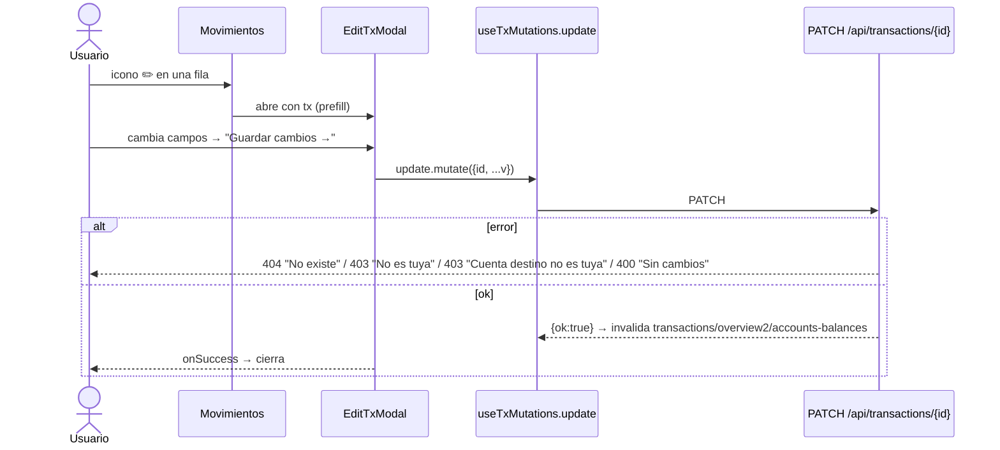
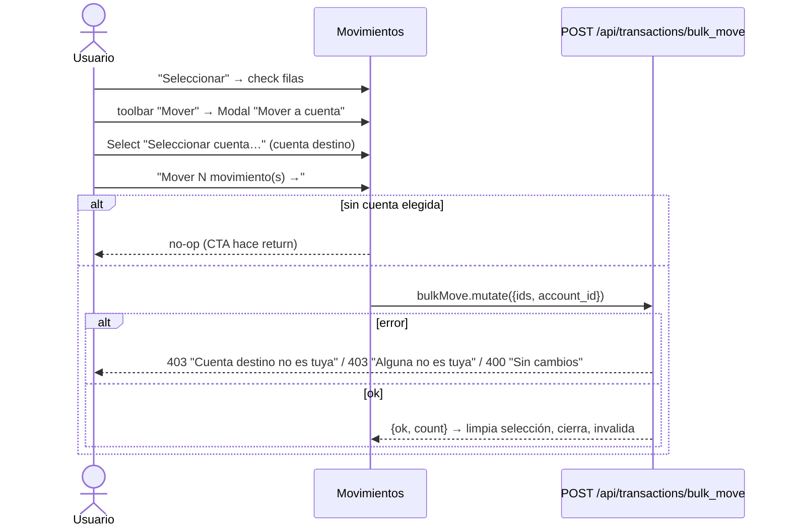
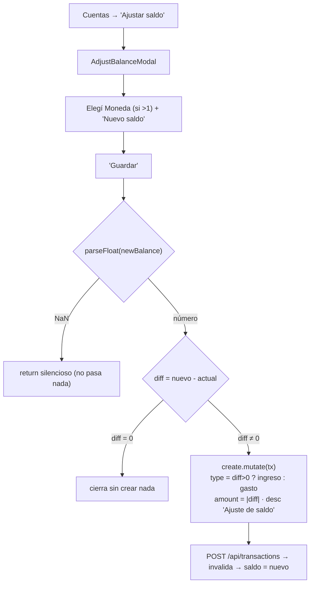
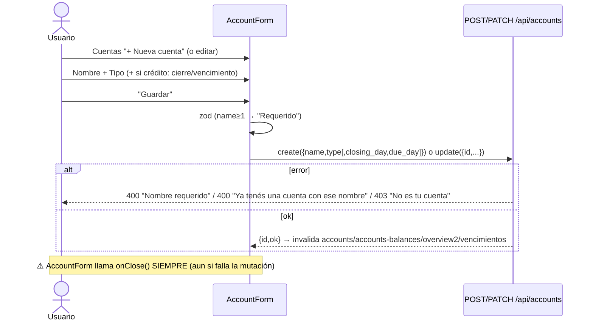
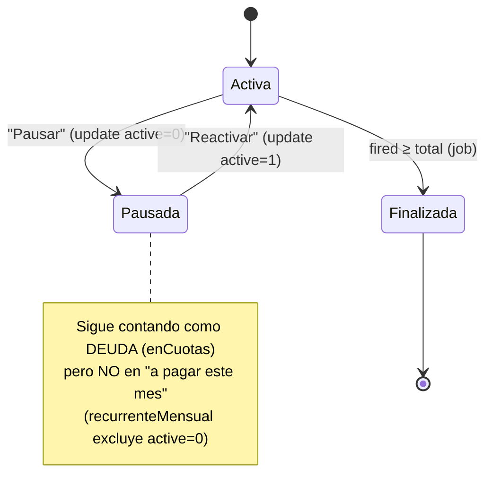
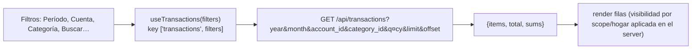
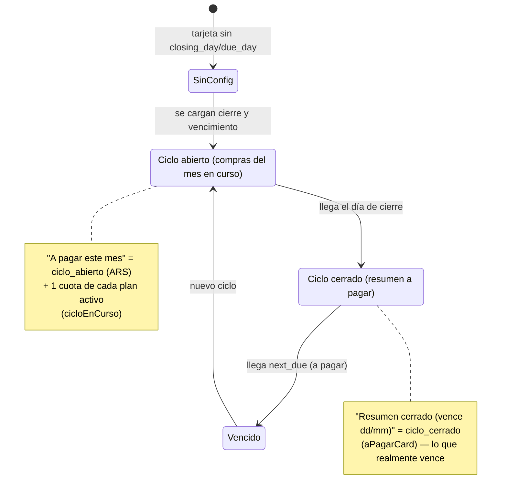
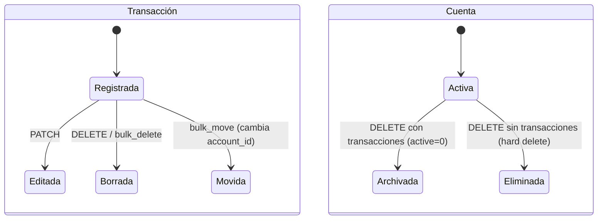

# Finanzas — Casos de uso y diagramas de estado

Cada flujo muestra el recorrido completo (usuario → UI → hook → API → DB) y qué se invalida. Recordá: **toda mutación de finanzas dispara un refetch** de las queries afectadas (no hay updates optimistas; no hay toasts — los errores se propagan como `ApiError` con el body del server).

## Índice de flujos
[Crear gasto/ingreso](#1-crear-gasto-o-ingreso-quickadd) · [Editar](#2-editar-un-movimiento) · [Borrar](#3-borrar-movimiento-individual-y-en-lote) · [Mover en lote](#4-mover-movimientos-en-lote) · [Ajustar saldo](#5-ajustar-saldo) · [Alta de cuenta](#6-crear--editar-cuenta) · [Alta de tarjeta](#7-alta--edición-de-tarjeta) · [Cuota](#8-alta-de-cuota-plan-de-cuotas) · [Recurrente](#9-crear-recurrente-fijo-mensual) · [Pausar](#10-pausarreactivar-recurrentecuota) · [Compartir](#11-compartir-una-cuenta) · [Buscar/filtrar](#12-buscar--filtrar-movimientos) · [Exportar](#13-exportar-csv) · [Transferencia](#14-transferencia-no-hay-endpoint)

---

## 1. Crear gasto o ingreso (QuickAdd)

```mermaid
sequenceDiagram
    actor U as Usuario
    participant QA as QuickAddSheet (GastoForm)
    participant H as useTxMutations.create
    participant API as POST /api/transactions
    participant DB as SQLite

    U->>QA: toca "+ Agregar" → pill "Gasto"
    U->>QA: completa Tipo, Monto, Descripción, Cuenta, (Categoría)
    U->>QA: "Guardar →"
    QA->>QA: zod valida (Monto>0, Descripción≥1, Cuenta int)
    alt inválido
        QA-->>U: "Monto inválido" / "Falta descripción"
    else válido
        QA->>H: create.mutate({type,amount,description,account_id,category_id,occurred_at})
        H->>API: POST con cookie (credentials:include)
        API->>API: valida required + cuenta existe + es del user
        alt error
            API-->>H: 400 "Falta {k}" / 400 "Cuenta inexistente" / 403 "Esa cuenta no es tuya"
            H-->>U: ApiError (sin toast)
        else ok
            API->>DB: INSERT transactions (user_id)
            API-->>H: {id, ok:true}
            H->>H: invalida ['transactions'],['overview2'],['accounts-balances']
            QA-->>U: onClose() → cierra; saldos/KPIs se recalculan
        end
    end
```

> El **ingreso** no es un flujo aparte: en el mismo GastoForm se cambia el Select Tipo a `Ingreso`. El saldo de la cuenta sube (`+amount`) en vez de bajar.

---

## 2. Editar un movimiento



---

## 3. Borrar movimiento (individual y en lote)

```mermaid
flowchart TD
    A["Movimientos"] --> B{"¿modo selección?"}
    B -- no --> C["icono 🗑️ en fila"]
    C --> D["ConfirmDialog: '¿Borrar este gasto?'<br/>'Se eliminará \"...\".'"]
    D -->|Cancelar| A
    D -->|Borrar| E["remove.mutate(id)<br/>DELETE /api/transactions/{id}"]
    B -- sí --> F["check filas → toolbar"]
    F --> G["'Borrar'"]
    G --> H["ConfirmDialog: '¿Borrar N gasto(s)?'<br/>'Esta acción no se puede deshacer.'"]
    H -->|Borrar| I["bulkDelete.mutate(ids)<br/>POST /api/transactions/bulk_delete"]
    E --> J["invalida transactions/overview2/accounts-balances"]
    I --> J
    I -. "403 'Alguna no es tuya' si alguna no es del user" .-> A
```

---

## 4. Mover movimientos en lote



---

## 5. Ajustar saldo

El "ajuste" no es una operación especial: crea una transacción compensatoria.



---

## 6. Crear / editar cuenta



---

## 7. Alta / edición de tarjeta

Una tarjeta **es una cuenta** con `type='credito'` + `closing_day` + `due_day`. Mismo `AccountForm` (con `defaultType="credito"`). Sin cierre/vencimiento, la tarjeta aparece pero `/api/vencimientos` devuelve `error: "Falta closing_day/due_day…"` y la UI muestra `"cargá cierre y vencimiento"`.

---

## 8. Alta de cuota (plan de cuotas)

Se crea desde **TarjetaDetalle → "+ Agregar cuota"** (CuotaModal) o desde **Recurrentes** poniendo `total_installments`. Una cuota es un `recurring` con `total_installments` seteado.

```mermaid
sequenceDiagram
    actor U as Usuario
    participant CM as CuotaModal (TarjetaDetalle)
    participant API as POST /api/recurring
    participant J as Job recurring_daily (bot, 9am)
    U->>CM: "+ Agregar cuota" → Descripción, Monto por cuota, Total de cuotas, Cuotas ya pagadas
    CM->>API: create({description, amount, account_id, day_of_month:1, total_installments, installments_fired, currency:'ARS'})
    API->>API: cuenta es del user; next_occurrence = _next_occurrence(day)
    API-->>CM: {id,ok} → invalida recurring/vencimientos/overview2
    Note over J: Cada día, si next_occurrence ≤ hoy y active=1
    J->>J: INSERT transaction (recurring_id, "(cuota fired+1/total)")
    J->>J: fired++ ; si fired ≥ total → active=0 (finaliza)
```

---

## 9. Crear recurrente (fijo mensual)

Igual que la cuota pero `total_installments = NULL` (vacío). En el modal: dejar vacío "Total de cuotas" (`"Dejar vacío si es fijo mensual"`). El job lo vuelve a programar cada mes indefinidamente.

---

## 10. Pausar/reactivar recurrente/cuota



---

## 11. Compartir una cuenta

```mermaid
sequenceDiagram
    actor U as Usuario
    participant C as Cuentas
    participant API as POST /api/share
    U->>C: toca pill "🔒 Privada" / "👥 Compartida"
    C->>API: toggleShared({entity:'accounts', id, shared: a.shared?0:1})
    API->>API: solo el dueño puede; 403 "No es tuyo" si no
    API-->>C: {ok, shared} → invalida TODAS las queries
    Note over C: Compartir una cuenta = compartir sus transacciones con el hogar
```

---

## 12. Buscar / filtrar movimientos

Los filtros son **en vivo** (cambian la query key → refetch). `buildQuery` traduce `period`:
- `mes` → year+month actual · `mes pasado` → mes anterior · `año` → solo year · `todo` → sin fechas.
- + `account_id`, `category_id` (`-1` = sin categoría), `currency`, `q` (LIKE en descripción).



> La **búsqueda global** (TopBar 🔍 → `/buscar`) es client-side sobre varias entidades; no hay `/api/buscar`.

---

## 13. Exportar CSV

`GET /api/export.csv?year&month` → stream con header `id,fecha,tipo,monto,moneda,cuenta,categoria,descripcion,persona`, nombre `transacciones_{year}_{mm}.csv`. (No hay botón documentado en las 7 pantallas React analizadas — el endpoint existe; el disparo está en el dashboard legacy.)

---

## 14. Transferencia (no hay endpoint)

**No existe** `/api/transfer`. Una transferencia se representa como transacción(es) en una categoría llamada literalmente `"Transferencia"`, que queda **excluida** de `overview2`, `trends` y totales (match por string). El parseo de "transferí X de A a B" vive en el **bot** (`main.py: handle_transferencia_intent`), no en la web.

---

# Diagramas de estado

## Ciclo de una tarjeta de crédito



Regla de fecha (de `vencimientos.py`): si `due_day > closing_day` el vencimiento cae el **mismo mes** del cierre; si `due_day ≤ closing_day`, el **mes siguiente**.

## Estado de una transacción / cuenta



---

Seguí en [`reglas-de-negocio.md`](./reglas-de-negocio.md) para los cálculos y la lógica de privacidad.
