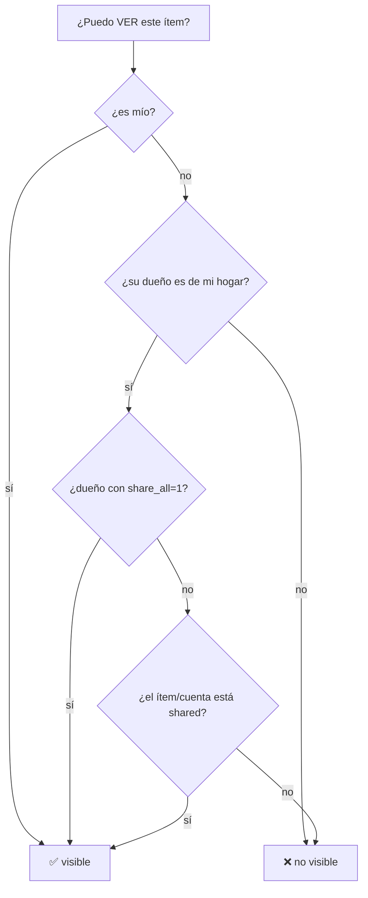

# Finanzas — Reglas de negocio y cálculos

## 1. Principio rector: no hay saldos guardados

No existe columna `balance`. Todo saldo se deriva de `transactions`:

```sql
SUM(CASE WHEN type='ingreso' THEN amount ELSE -amount END)
GROUP BY account_id, currency
```

- `gasto` (y cualquier tipo ≠ `ingreso`) **resta**; `ingreso` **suma**.
- Los saldos son **por moneda** (nunca se suman ARS+USD a nivel SQL).
- Editar/borrar una transacción cambia el saldo al instante.

## 2. El modelo de tarjetas (`lib/cards.ts`) — fuente de verdad del front

| Concepto | Función | Fórmula | Significado |
|---|---|---|---|
| Saldo ARS | `arsBalance(acc)` | balance con `currency==='ARS'`, si no el primero, si no `0` | saldo de la tarjeta (negativo si debe) |
| **Consumos** | `consumos(acc)` | `Math.abs(arsBalance(acc))` | gasto cargado a la tarjeta |
| **Cuotas por venir** | `enCuotas(cardId, rec)` | Σ `amount × max(0, total − fired)` sobre planes con `total_installments` | deuda futura de cuotas — **incluye pausadas** |
| **Deuda total** | `deudaTotal(...)` | `consumos + enCuotas` | todo lo que queda por pagar |
| **Cuota actual** | `cuotaActual(r)` | `min(fired + 1, total)` | número de cuota en curso (igual que el bot) |
| Suma de ciclo | `cicloArs(arr)` | Σ `total` de `arr` con `currency==='ARS'` | helper |
| **A pagar ahora** (1 tarjeta) | `aPagarCard(venc)` | `cicloArs(venc.ciclo_cerrado)` | resumen cerrado que vence — **NO la deuda total** |
| A pagar ahora (todas) | `aPagarTotal(vencs)` | Σ `cicloArs(v.ciclo_cerrado)` | para Home |
| Carga mensual | `recurrenteMensual(cardId, rec)` | Σ `amount` de recurrentes **activos** (1 cuota c/u, + fijos) con cuotas restantes | lo que se paga este mes por recurrentes/cuotas |
| **A pagar este mes** (1 tarjeta) | `cicloEnCurso(...)` | `cicloArs(venc.ciclo_abierto) + recurrenteMensual(...)` | compras del ciclo en curso + 1 cuota de cada plan |
| A pagar este mes (todas) | `cicloEnCursoTotal(...)` | Σ por tarjeta | para Home |

**La asimetría clave (intencional y documentada):**
- `enCuotas` (DEUDA) → incluye planes **pausados** y la **deuda completa restante**.
- `recurrenteMensual` (MENSUAL) → **excluye pausados** y cuenta **una sola cuota** por plan.
- *Por qué:* las cuotas **no son transacciones**, así que `/api/vencimientos` (que mira el ciclo en `transactions`) no las incluye → se suman en JS.

## 3. Cálculos del backend

### Totales de ingresos/gastos del mes (`overview2`)
```sql
SELECT t.currency, SUM(t.amount) FROM transactions t
LEFT JOIN categories c ON c.id=t.category_id
WHERE t.type=? AND COALESCE(c.name,'')!='Transferencia'
  AND t.occurred_at>=? [AND <=?]
GROUP BY t.currency
```
Cada moneda se valúa a ARS con `ars(amount,cur) = amount * blue` (USD/EUR, si hay blue) y se suma. **Las transferencias se excluyen por nombre de categoría** `"Transferencia"`.

**KPIs (`overview2.kpis`):**
- `gasto_mes` = gastos desde inicio de mes.
- `gasto_prev_alt` = mes anterior **hasta el día equivalente** (comparación justa mes-a-fecha).
- `deuda_tarjetas` = Σ de saldos ARS negativos de cuentas `credito`.
- `disponible` = Σ de saldos positivos de cuentas no-`credito`.
- `cuotas_futuras` / `cuotas_n` = Σ `rem × amount` (rem = `total - fired`) sobre recurrentes con cuotas.
- `patrimonio_ars` = Σ saldos valuados a ARS; `patrimonio_usd = patrimonio_ars / blue`.

### Ciclo y vencimiento de tarjeta (`vencimientos.py`)
`_venc_para_cierre(cierre, closing_day, due_day)`:
- `dd > cd` → vence el **mismo mes** del cierre (ej. cierra 2 / vence 13 → cierra 02/03, vence 13/03).
- `dd ≤ cd` → vence el **mes siguiente** (ej. cierra 28 / vence 5).

`proximo_cierre_y_vencimiento(cd, dd, hoy)` → `(last_closing, next_closing, next_due)`:
- `last_closing` = cierre ya cerrado (este mes si `hoy.día > cd`, si no el anterior).
- `next_closing` = donde caen las compras de hoy (este mes si `hoy.día ≤ cd`, si no el siguiente).
- `next_due` = `_venc_para_cierre(last_closing)`, y si ya pasó → `_venc_para_cierre(next_closing)`.

`calcular_vencimiento(...)`:
- **Ciclo cerrado** = `(prev_prev+1día) … last_closing`. **Ciclo abierto** = `(last_closing+1día) … next_closing`.
- Ambos suman `gasto` con **`recurring_id IS NULL`** (las cuotas se cuentan por el plan, **no** como transacción del ciclo → evita doble conteo).

### Cómo se disparan las recurrentes (`main.py: recurring_daily`, 9am)
- Selecciona `recurring WHERE active=1 AND next_occurrence ≤ hoy`.
- Inserta transacción en `hoy T09:00` con `recurring_id`, descripción `"… (cuota fired+1/total)"`.
- `fired++`; si `total AND fired ≥ total` → `active=0` (finaliza); si no, reprograma `next_occurrence`.
- Manda aviso a Telegram con botón "❌ Cancelar (no se cobró)".
- **Al crear** con disparo inmediato: cuota 1 al instante; para tarjetas con cierre+vencimiento, `occurred_at = venc_de_cuota` (la fecha de vencimiento).

### Patrimonio (`networth.py`) — **personal**
- Cada saldo se valúa por separado a ARS y a USD (`total_ars`, `total_usd` independientes — nunca ARS+USD sumados).
- `rate_type` por cuenta (`preferred_fx_rate`, default `blue`); `takenos` → tasa manual o `cripto`.
- Monedas no soportadas (EUR…) se saltan (no entran al total).
- **`/api/networth` ignora el scope "ours"**: solo muestra las cuentas propias del que pregunta (divergencia deliberada del resto del módulo).

### FX (`fx.py`)
- Solo convierte **USD↔ARS**; otro par → `ValueError "par no soportado"`.
- Tasas servidas **cacheadas** (refresco en background cada 600s); si nunca se calentó, `blue=0` → `patrimonio_usd=null` y los montos FX se tratan como ARS.

### Otros (`finance.py`, `affordability.py`, `splits.py`)
- `project_month_end(spent, day, days)` = `spent/day*days`.
- `budget_status`: `ok` (<80%) / `warn` (80–100%) / `over` (≥100%); `BUDGET_WARN_PCT=80`.
- `is_anomaly(amount, hist)`: ≥4 puntos; true si `amount > 3×mediana` o `> media + 4×std`.
- `afford_verdict`: `affordable` si saldos − costo ≥ 0; `budget_ok` si costo ≤ presupuesto restante.
- Splits (gastos compartidos): `net_balance` solo cuenta **impagos** (`settled_at IS NULL`) del par exacto; positivo = el otro me debe. Strings: `"Estan a mano 🤝"`, `"🟢 {x} te debe {m}"`, `"🔴 Le debes a {x} {m}"`.

## 4. Multi-inquilino, scope y visibilidad

### Hogar
```sql
-- miembros del hogar de un usuario:
SELECT id FROM users
WHERE COALESCE(household_id,id) = (SELECT COALESCE(household_id,id) FROM users WHERE id=?)
```
El hogar = todos los que comparten `COALESCE(household_id, id)`.

### Scope (cookie `scope`, `resolve_scope_uid`)
- `mine` (default) → `user.id`.
- `ours`/`ambos`/`both`/`shared` → `None` (= todo el hogar) **solo si el hogar tiene >1 miembro**; si es de 1, → `user.id` (un hogar de 1 nunca ve "ambos").
- `user:X` → X **solo si X es del hogar**, si no cae a `user.id`.

### Visibilidad (`visibility.where`) — primitiva de privacidad
Ves un ítem si: (a) es tuyo, **o** (b) su dueño (de tu hogar) tiene `share_all=1`, **o** (c) el ítem está compartido.
- **Transacciones** "compartido" = la **cuenta** está compartida (`account_id IN (accounts WHERE shared=1)`).
- **Recurrentes** = por `account.shared`.
- **Eventos/tareas/notas/listas** = columna `shared=1`.



### Quién puede EDITAR (más estricto que ver)
- Transacciones / cuentas / recurrentes / budgets: **solo el dueño exacto** (`user_id == user.id`) → si no, `403 "No es tuya"`/`"No es tu cuenta"`. Una cuenta compartida es **visible** para el hogar pero solo el dueño la muta.
- Tareas/notas: propio **o** compartido del mismo hogar (`assert_ownership(allow_shared=True)`).
- Categorías: por hogar; las default (`household_id NULL`) solo admin.
- Patrimonio: nunca expone el de otro miembro.
- `POST /api/share` y `share_all`: solo el dueño.

## 5. Validaciones (resumen front + back)

| Entidad | Front (zod/RHF) | Back |
|---|---|---|
| Transacción | `amount>0` ("Monto inválido"), `description≥1` ("Falta descripción"), `account_id` int, `type` enum | required `amount/account_id/occurred_at/type` ("Falta {k}"); cuenta existe ("Cuenta inexistente") y es del user ("Esa cuenta no es tuya") |
| Cuenta | `name≥1` ("Requerido"); cierre/vencimiento 1–31 (**error no se muestra**) | name requerido ("Nombre requerido"); único por user ("Ya tenés una cuenta con ese nombre") |
| Categoría | `name` required (sin mensaje visible) | name requerido; único en hogar+defaults ("Ya existe"); default no editable ("Categoría compartida (no editable)") |
| Recurrente | `description≥1`, `amount>0` ("Debe ser mayor a 0"), `account_id` req, `day_of_month` 1–31 | cuenta del user; `day_of_month` clamp 1–28 (en creación crud_v2) |
| Budget | — | `amount>0` ("El monto debe ser positivo"); único (cat,user) |
| Ajuste saldo | `isNaN` → return silencioso; `diff=0` → cierra | (entra como transacción normal) |
| Login | — | rate-limit 10/IP y 6/usuario por 5min ("Demasiados intentos. Esperá unos minutos."); "Usuario o contraseña incorrectos" |

## 6. Casos límite / comportamientos especiales

- **`arsBalance` cae al primer balance** si no hay ARS → una cuenta solo-USD se trataría como ARS en `consumos`/`deudaTotal` (edge case).
- **`category_id = -1`** = sentinela "sin categoría" (`IS NULL`) en el filtro de transacciones.
- **Transferencia = string mágico** `"Transferencia"` (acoplamiento por nombre).
- **Ciclo excluye `recurring_id`** para no doble-contar cuotas.
- **`due_day > closing_day`** invierte el mes de vencimiento (sutil pero correcto).
- **Dos paths de creación de recurrente** con clamps de día distintos (crud_v2 ≤28 vs `recurrence.next_occurrence` a fin de mes) → leve inconsistencia.
- **`AccountForm` cierra aun si la mutación falla** (no espera `onSuccess`).
- **`toggleShared` invalida TODAS las queries** (caro).
- **`set_scope` invalida TODAS las queries** (refetch global al cambiar de quién ves).

---

Seguí en [`analisis-critico.md`](./analisis-critico.md) para bugs, inconsistencias y mejoras.
